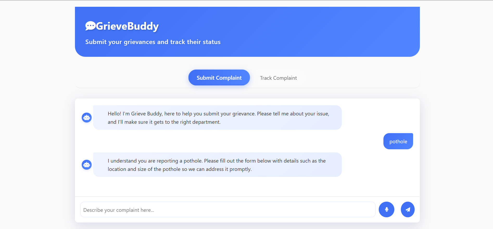
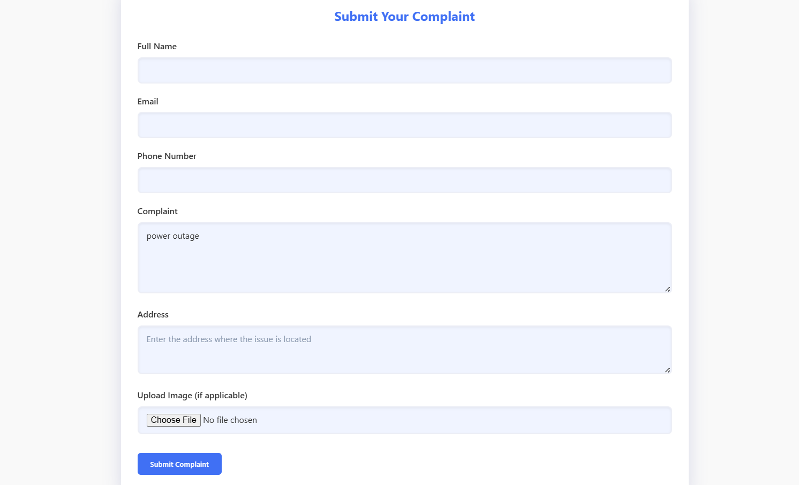
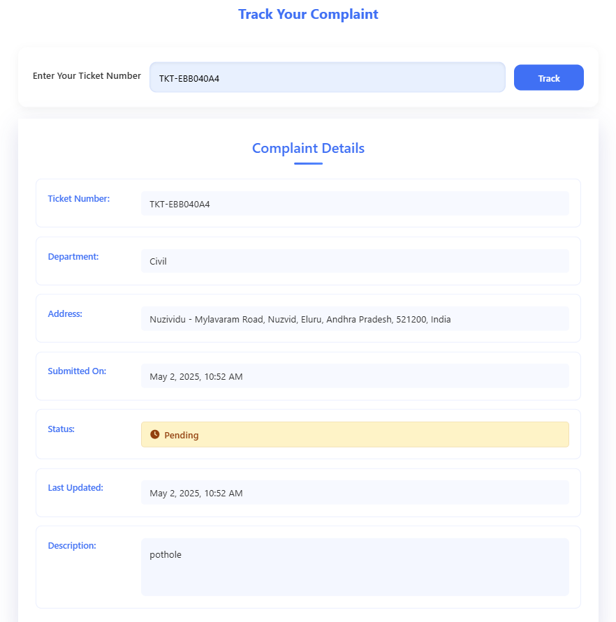
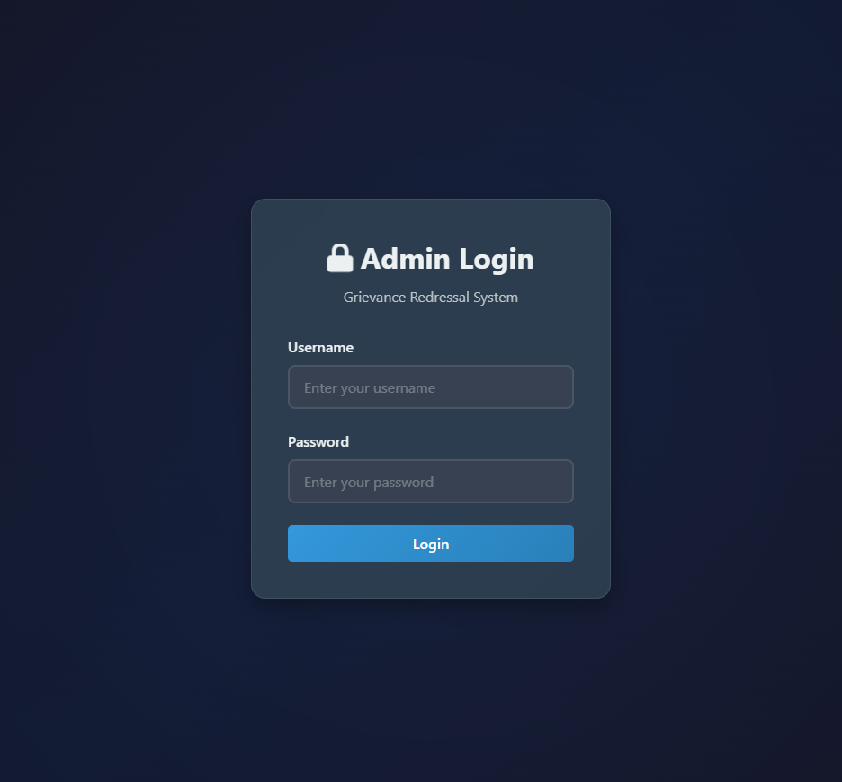
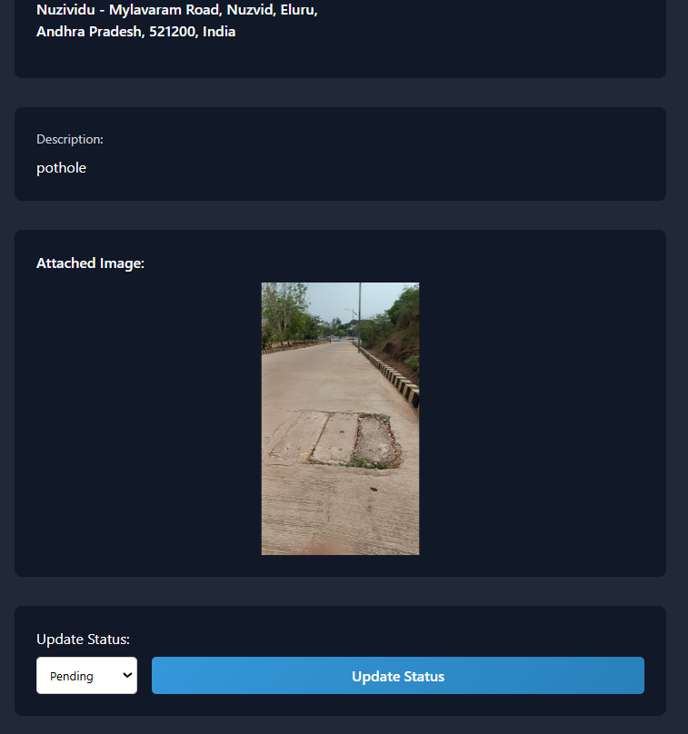
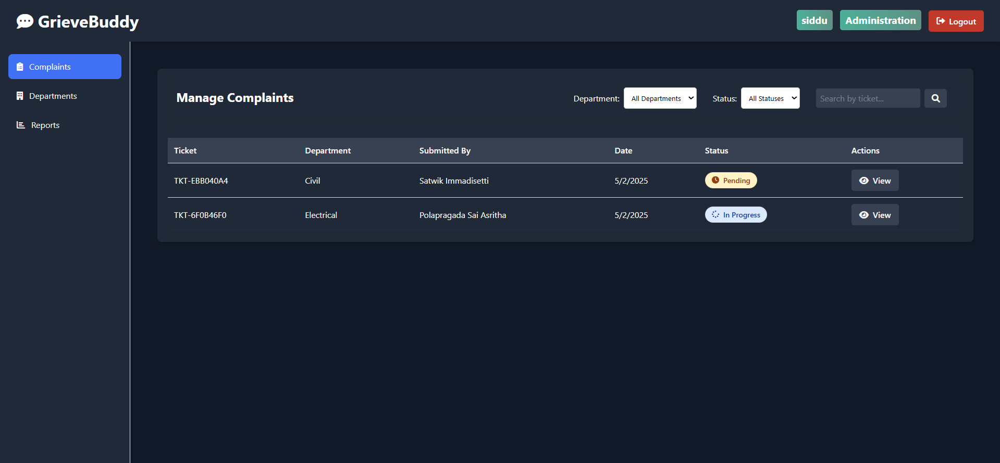
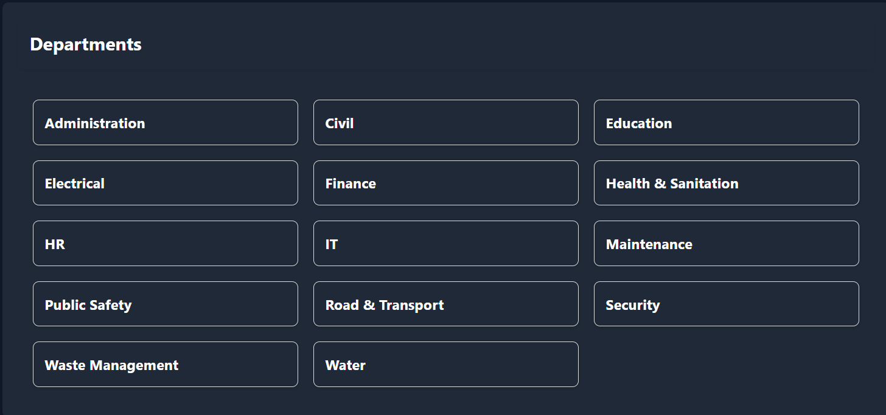
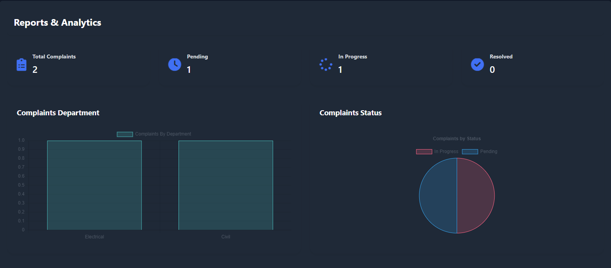

# Grievance Redressal Chatbot

A comprehensive grievance redressal system with AI-powered chatbot support, image verification, and GPS location tracking. This system helps citizens submit and track their complaints about government services efficiently. The project streamlines entire process.

## 🌟 Key Features

### For Citizens
- 🤖 Intelligent AI-powered chatbot for automated complaint assessment and guidance
- 📸 Secure image upload with integrated GPS location verification
- 🔍 Advanced image relevance verification using CLIP technology
- 📱 Comprehensive real-time complaint status monitoring
- 💬 Intuitive chat interface for streamlined complaint submission
- 📍 Automated location detection and validation from image metadata

### For Administrators
- 📊 Enterprise-grade administrative dashboard
- 📈 Advanced analytics and real-time reporting capabilities
- 🔍 Sophisticated complaint filtering and search functionality
- 👥 Department-specific complaint management system
- 📱 Cross-platform responsive administrative interface
- 📊 Interactive data visualization and analytics dashboard

## 🛠️ Tech Stack

### Backend
- **Framework**: Flask 3.0.0 (Python web framework)
- **Database**: MySQL 8.2.0
- **AI/ML**:
  - Google Gemini AI for chatbot
  - CLIP for image verification
  - Transformers for text processing
- **Location Services**: Geopy for GPS processing
- **Image Processing**: Pillow for image handling

### Frontend
- HTML5
- CSS3
- Vanilla JavaScript
- Responsive Design
- Chart.js for analytics

## 📋 Prerequisites

- Python 3.8 or higher
- MySQL Server 8.0 or higher
- Google Cloud API Key (for Gemini AI integration)
- Modern web browser with JavaScript support
- Git version control system

## 🚀 Installation

1. **Clone the repository**:
```bash
git clone <repository-url>
cd GrievanceRedressalChatbot
```

2. **Set up virtual environment**:
```bash
python -m venv .venv
# On Windows
.venv\Scripts\activate
# On Unix/MacOS
source .venv/bin/activate
```

3. **Install dependencies**:
```bash
pip install -r requirements.txt
```

4. **Configure MySQL**:
- Create a database named `grievance_db`
- Update database configuration in `backendflask.py`:
```python
db_config = {
    "host": "localhost",
    "user": "your_username",
    "password": "your_password",
    "database": "grievance_db"
}
```

5. **Configure Google Gemini AI**:
- Get your API key from Google Cloud Console
- Update the API key in `backendflask.py`:
```python
genai.configure(api_key="your_api_key")
```

6. **Environment Variables**:
Create a `.env` file in the root directory:
```env
FLASK_APP=backendflask.py
FLASK_ENV=development
SECRET_KEY=your_secret_key
DB_HOST=localhost
DB_USER=your_username
DB_PASSWORD=your_password
DB_NAME=grievance_db
GEMINI_API_KEY=your_gemini_api_key
```

## 🏃‍♂️ Running the Application

1. **Start the Flask server**:
```bash
python backendflask.py
```

2. **Access the application**:
- User Interface: `http://localhost:5500/user/index.html`
- Admin Interface: `http://localhost:5500/admin/index.html`

## 📁 Project Structure

```
GrievanceRedressalChatbot/
├── backendflask.py          # Core application logic
├── requirements.txt         # System dependencies
├── .env                     # Environment configuration
├── uploads/                 # Secure image storage
├── user/                    # User interface components
│   ├── index.html          # Primary user interface
│   ├── styles.css          # User interface styling
│   └── script.js           # User interface logic
└── admin/                   # Administrative interface
    ├── index.html          # Administrative dashboard
    ├── styles.css          # Administrative styling
    └── script.js           # Administrative logic
```

## 🔒 Security Features

- Secure session management with Flask
- CORS protection for API endpoints
- Input validation and sanitization
- Image verification and validation
- GPS location validation
- Secure password handling
- API key protection

## 📊 API Endpoints

### User Endpoints
- `POST /api/submit_complaint` - Submit new complaint
- `POST /api/track_complaint` - Track complaint status
- `POST /api/chat` - Interact with AI chatbot

### Admin Endpoints
- `POST /api/admin/login` - Admin authentication
- `GET /api/admin/complaints` - Get all complaints
- `POST /api/admin/update_status` - Update complaint status
- `GET /api/admin/reports` - Get analytics data
- `GET /api/admin/departments` - Get department list

## 📸 System Interface

### User Interface


*AI Chatbot interface for submitting complaints*



*Complaint submission form with image upload*



*Complaint tracking interface showing status and details*

### Admin Interface


*Administration login*



*Detailed complaint management interface*



*Complaints list with filtering and status management*



*Department-wise complaint management*



*Statistical reports and charts*

## 🤝 Contribution Guidelines

1. Fork the repository
2. Create your feature branch (`git checkout -b feature/AmazingFeature`)
3. Commit your changes (`git commit -m 'Add some AmazingFeature'`)
4. Push to the branch (`git push origin feature/AmazingFeature`)
5. Open a Pull Request

## 📝 License

This project is licensed under the MIT License - see the [LICENSE](LICENSE) file for details.

## 🆘 Technical Support

For support:
- Open an issue in the repository
- Contact the maintainers
- Check the documentation

## 🙏 Acknowledgments

- Google Gemini AI for chatbot capabilities
- CLIP team for image verification
- Flask team for the web framework
- All the contributors of project
